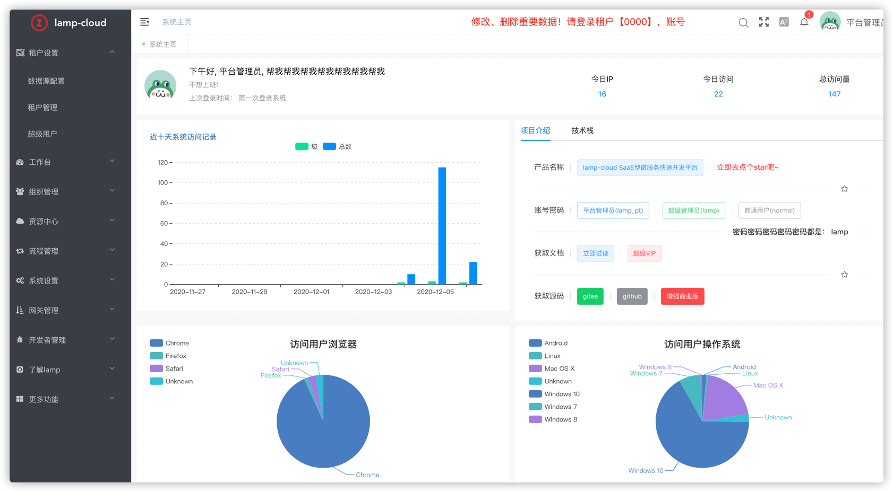
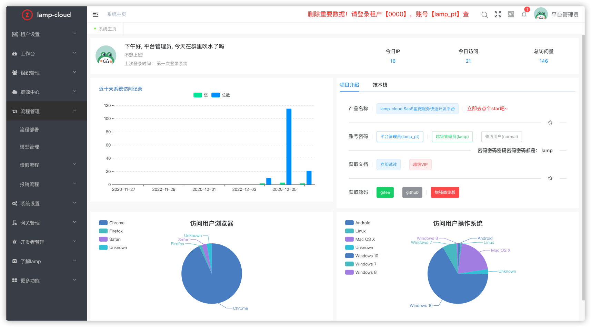

# lamp 快速开发平台

# lamp 项目名字由来
## 叙事版：
在一个夜黑风高的晚上，小孩吵着要出去玩，于是和`程序员老婆`一起带小孩出去放风，路上顺便讨论起项目要换个什么名字，在各自想出的名字都被对方一一否决后，大家陷入了沉思。
走着走着，在一盏路灯下，孩砸盯着路灯打破宁静，喊出：灯灯～ 我和媳妇愣了一下，然后对视着一起说：哈哈，这个名字好～

## 解释版：
`灯灯`： 是我小孩学说话时会说的第一个词，也是我在想了很多项目名后，小孩一语点破的一个名字，灯灯象征着光明，给困境的我们带来希望，给加班夜归的程序员们指引前方～

`灯灯`(简称灯， 英文名：lamp)，他是一个项目的统称，包含以下几个子项目

## lamp 项目组成
注意： 请先下载lamp-util 代码并编译（mvn install） 到本地仓库，然后在编译（mvn install）lamp-cloud或lamp-boot项目， 最后编译（mvn install）lamp-job项目！！！ 然后在启动lamp-web！！！
## 工具集

| 项目 | gitee | github | 备注 |
| --- | --- | --- | --- |
| lamp-util | [lamp-util](https://gitee.com/zuihou111/lamp-util) | [lamp-util](https://github.com/zuihou/lamp-util) | 核心工具集 |
| lamp-generator | [lamp-generator](https://gitee.com/zuihou111/lamp-generator) | [lamp-generator](https://github.com/zuihou/lamp-generator) | 代码生成器 |
| lamp-job | [lamp-job](https://gitee.com/zuihou111/lamp-job) | [lamp-job](https://github.com/zuihou/lamp-job) | 分布式定时调度器 |

## 后端

| 项目 | gitee | github | 备注 |
| --- | --- | --- | --- |
| lamp-cloud | [lamp-cloud](https://gitee.com/zuihou111/lamp-cloud) |  [lamp-cloud](https://github.com/dromara/lamp-cloud) | SpringCloud(微服务)版 |
| lamp-boot | [lamp-boot](https://gitee.com/zuihou111/lamp-boot) |  [lamp-boot](https://github.com/zuihou/lamp-boot) | SpringBoot(单体)版 |
| 微服务版示例 | [lamp-samples](https://github.com/zuihou/lamp-samples) | [lamp-samples](https://github.com/zuihou/lamp-samples) | 常用示例 |

## 前端

| 项目 | gitee | github | 备注 | 演示地址 |
| --- | --- | --- | --- | --- |
| lamp-web | [lamp-web](https://gitee.com/zuihou111/lamp-web) | [lamp-web](https://github.com/zuihou/lamp-web) | 基于 vue-admin-element (element-ui) | http://tangyh.top:10000 |
| lamp-web-plus(强烈推荐！👏👏👏) | [lamp-web-plus](https://gitee.com/zuihou111/lamp-web-plus) | [lamp-web-plus](https://github.com/zuihou/lamp-web-plus) | 基于 vue-vben-admin （vue 3 + ant design vue 2） | http://tangyh.top:3100 |
| lamp-web-beautiful(暂时停更) | [lamp-web-beautiful](https://gitee.com/zuihou111/lamp-web-beautiful) | [lamp-web-beautiful](https://github.com/zuihou/lamp-web-beautiful) | 基于 vue-admin-beautiful | http://tangyh.top:180 |

# lamp-web 简介
`lamp-web` 的前身是`zuihou-ui` + `zuihou-admin-ui`，从3.0.0版本开始，将2个系统合并为`lamp-web`，它是`lamp`项目的其中一员。原来在zuihou-admin-ui系统的功能已经合并到内置租户【0000】，账号【lamp_pt】中。

`lamp-web` 是 [lamp-cloud](https://github.com/dromara/lamp-cloud) 和 [lamp-boot](https://github.com/zuihou/lamp-boot) 2个后台项目共用的管理后台，仅需在启动时调整`vue.config.js`文件中的代理。它基于[vue element admin](https://panjiachen.github.io/vue-element-admin-site/zh/)构建。

## lamp 会员版项目演示地址

- 地址： https://tangyh.top

> ps: 演示环境中内置租户没有写入权限，若要在演示环境测试增删改，请使用lamp_pt账号查询租户管理员账号后,登录新租户测试

## lamp-cloud/lamp-boot + lamp-web 功能介绍：
1. 租户管理：运营人员管理所有的租户创建
2. 工作台：普通用户常用功能
3. 组织管理：组织、岗位、用户数据维护、重置用户密码等
4. 资源中心：消息、短信、附件管理
5. 流程管理：流程部署、模型管理、流程示例
6. 系统设置：菜单、资源配置、角色管理、给角色绑定用户、给角色授权菜单和资源、字典、地区、系统参数、操作日志、登录日志、应用管理等
7. 网关设置：限流和阻止访问
8. 开发者管理：定时任务、接口文档、注册&配置中心、服务监控、数据库监控、zipkin监控、SkyWalking监控

## 技术栈

- Vue
- ES6
- Webpack
- Vue-cli
- Vue-router
- Vuex
- Axios
- Element-UI
- ECharts

# 项目截图：

| 预览 | 预览 |
|---|---|
|  |  |
|  |  |
|  |  |
|  |  |
|  |  |
|  |   |
|  |  |

# 交流群，加群前请先给项目点个 "Star"，谢谢！😘

- 63202894(主群 满员请加群2)
- 1011148503(群2)    

# 如果觉得本项目对您有任何一点帮助，请点右上角 "Star" 支持一下， 并向您的基友、同事们宣传一下吧，谢谢！

# 详细文档:  https://www.kancloud.cn/zuihou/zuihou-admin-cloud
    ps: gitee捐献 或者 二维码打赏(本页最下方)： 45元及以上 并 备注邮箱，可得开发文档一份(支持后续更新) 
        打赏或者捐献后直接加群：1039545140 并备注打赏时填写的邮箱，可以持续的获取最新的文档。 

# 遇到问题请先查看历史issue，未找到解决方案，在提交issue(问题描述详细一些，报错截图大一些，复现步骤全一些)
    https://github.com/dromara/lamp-cloud/issues    

# 会员版
本项目分为开源版和会员版，github和gitee上能搜索到的为开源版本，遵循Apache协议。 会员版源码在私有gitlab托管，购买后开通账号。

会员版和会员版区别请看：[会员版](https://www.kancloud.cn/zuihou/zuihou-admin-cloud/2074547)

# 项目不错，支持一下吧

# 感谢 JetBrains 提供的免费开源 License：

    
# 友情链接 & 特别鸣谢
* 微服务快速开发平台：[https://github.com/dromara/lamp-cloud](https://github.com/dromara/lamp-cloud)
* 单体快速开发平台：[https://github.com/zuihou/lamp-boot](https://github.com/zuihou/lamp-boot)
* MyBatis-Plus：[https://mybatis.plus/](https://mybatis.plus/)
* knife4j：[http://doc.xiaominfo.com/](http://doc.xiaominfo.com/)
* hutool：[https://hutool.cn/](https://hutool.cn/)
* xxl-job：[http://www.xuxueli.com/xxl-job/](http://www.xuxueli.com/xxl-job/)
* kkfileview：[https://kkfileview.keking.cn](https://kkfileview.keking.cn)
* vue-vben-admin： [https://github.com/anncwb/vue-vben-admin](https://github.com/anncwb/vue-vben-admin) lamp-web-plus 基于本项目改造  
* FEBS Cloud Web： [https://gitee.com/mrbirdd/FEBS-Cloud-Web](https://gitee.com/mrbirdd/FEBS-Cloud-Web)
    lamp-web 基于本项目改造， 感谢 [wuyouzhuguli](https://github.com/wuyouzhuguli)
* Cloud-Platform： [https://gitee.com/geek_qi/cloud-platform](https://gitee.com/geek_qi/cloud-platform)
    作者学习时接触到的第一个微服务项目

