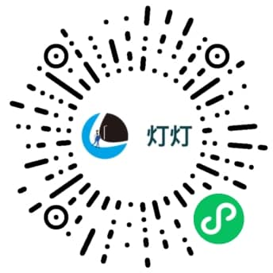

# lamp 快速开发平台

[](https://github.com/dromara/lamp-cloud) 
[](https://github.com/dromara/lamp-cloud/blob/master/LICENSE) 
[](https://github.com/zuihou) 
[](https://github.com/dromara/lamp-cloud/stargazers) 
[](https://github.com/dromara/lamp-cloud/network/members) 
[](https://gitee.com/dromara/lamp-cloud/stargazers) 
[](https://gitee.com/dromara/lamp-cloud/members)


## 小程序免费看文档



## lamp-cloud/lamp-boot + lamp-web 功能介绍：

1. 租户管理：运营人员管理所有的租户创建
2. 工作台：普通用户常用功能
3. 组织管理：组织、岗位、用户数据维护、重置用户密码等
4. 资源中心：消息、短信、附件管理
5. 流程管理：流程部署、模型管理、流程示例
6. 系统设置：菜单、资源配置、角色管理、给角色绑定用户、给角色授权菜单和资源、字典、地区、系统参数、操作日志、登录日志、应用管理等
7. 网关设置：限流和阻止访问
8. 开发者管理：定时任务、接口文档、注册&配置中心、服务监控、数据库监控、zipkin 监控、SkyWalking 监控

## 技术栈

- Vue 3
- vuex 4
- typescript 4
- ant-design-vue 3
- axios
- echarts
- vite

## 安装

### 环境要求

- `Node.js`: - 版本大于 `20.0.0`
- `pnpm` : - 版本大于 `8.6.0`.

  ```
  ## 安装 pnpm
  npm install -g pnpm
  ```

### 下载并安装依赖

```
//  使git对文件名大小写敏感
git config core.ignorecase false

// 拉取项目代码

git clone https://github.com/zuihou/lamp-web.git

cd lamp-web

// 如果使用别的包管理工具，可以自行安装
pnpm install --registry=https://registry.npmmirror.com
```

## 使用

### 开发环境

```bash
pnpm dev
```

### 打包

```bash

pnpm build # 打包
```


## 工具集

| 项目             | gitee                                                        | github                     | gitcode                                | 备注       |
|----------------|--------------------------------------------------------------|------------------------------------------------------------|------------------------------------------------------------|----------|
| lamp-util      | [lamp-util](https://gitee.com/zuihou111/lamp-util)           | [lamp-util](https://github.com/zuihou/lamp-util)   | [lamp-util](https://gitcode.com/zuihou/lamp-util)           | 核心工具集    |
| lamp-job       | [lamp-job](https://gitee.com/zuihou111/lamp-job)             | [lamp-job](https://github.com/zuihou/lamp-job)    | [lamp-job](https://gitcode.com/zuihou/lamp-job)             | 分布式定时调度器 |

## 后端

| 项目         | gitee                                                  | github           | gitcode                                             | 备注                |
|------------|--------------------------------------------------------|--------------------------------------------------------|-----------------------------------------------------|-------------------|
| lamp-cloud | [lamp-cloud](https://gitee.com/dromara/lamp-cloud)     | [lamp-cloud](https://github.com/dromara/lamp-cloud)  | [lamp-cloud](https://gitcode.com/zuihou/lamp-cloud) | SpringCloud(微服务)版 |
| lamp-boot  | [lamp-boot](https://gitee.com/zuihou111/lamp-boot)     | [lamp-boot](https://github.com/zuihou/lamp-boot)    | [lamp-boot](https://gitcode.com/zuihou/lamp-boot)    | SpringBoot(单体)版   |

## 前端

| 项目                         | gitee                                                      | github                                                 | gitcode                                                   | 备注            | 演示地址                     |
|----------------------------|------------------------------------------------------------|----------------------------------------------------------|----------------------------------------------------------|---------------|--------------------------|
| lamp-web                   | [lamp-web](https://gitee.com/zuihou111/lamp-web)           | [lamp-web](https://github.com/zuihou/lamp-web)    | [lamp-web](https://gitcode.com/zuihou/lamp-web)           | 基于 vben-admin | https://none.tangyh.top  |


# 友情链接 & 特别鸣谢

- 微服务快速开发平台：[https://github.com/zuihou/lamp-cloud](https://github.com/zuihou/lamp-cloud)
- 单体快速开发平台：[https://github.com/zuihou/lamp-boot](https://github.com/zuihou/lamp-boot)
- MyBatis-Plus：[https://mybatis.plus/](https://mybatis.plus/)
- knife4j：[http://doc.xiaominfo.com/](http://doc.xiaominfo.com/)
- hutool：[https://hutool.cn/](https://hutool.cn/)
- xxl-job：[http://www.xuxueli.com/xxl-job/](http://www.xuxueli.com/xxl-job/)
- kkfileview：[https://kkfileview.keking.cn](https://kkfileview.keking.cn)
- vue-vben-admin： [https://github.com/anncwb/vue-vben-admin](https://github.com/anncwb/vue-vben-admin) lamp-web-plus 基于本项目改造
- FEBS Cloud Web： [https://gitee.com/mrbirdd/FEBS-Cloud-Web](https://gitee.com/mrbirdd/FEBS-Cloud-Web) lamp-web 基于本项目改造， 感谢 [wuyouzhuguli](https://github.com/wuyouzhuguli)
- Cloud-Platform： [https://gitee.com/geek_qi/cloud-platform](https://gitee.com/geek_qi/cloud-platform) 作者学习时接触到的第一个微服务项目
