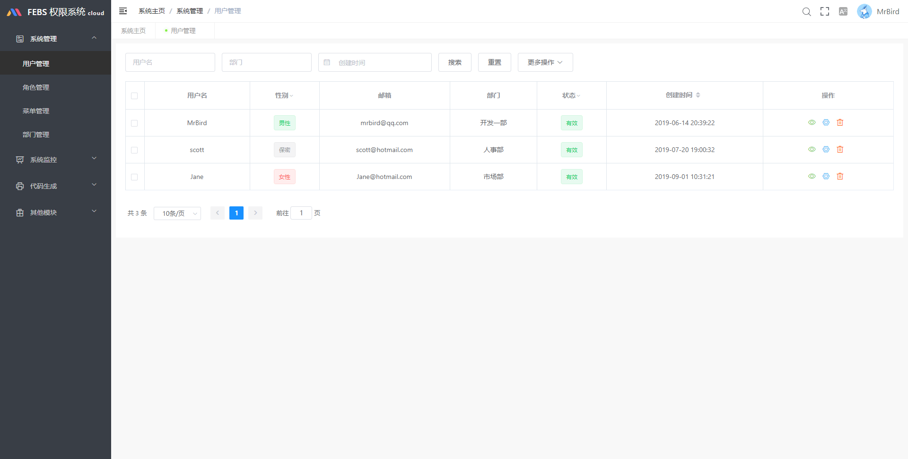
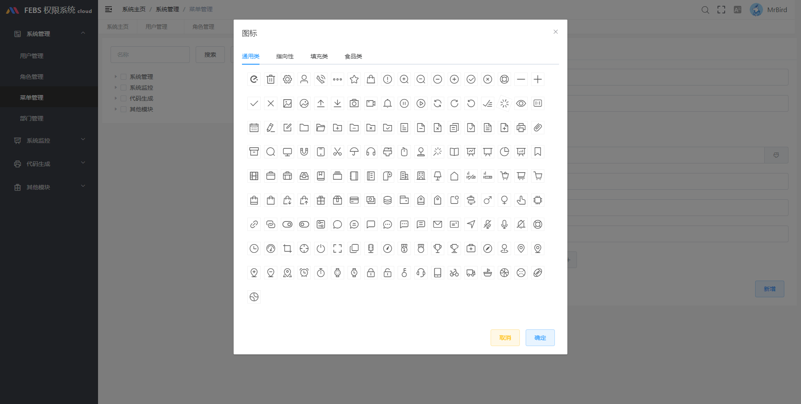
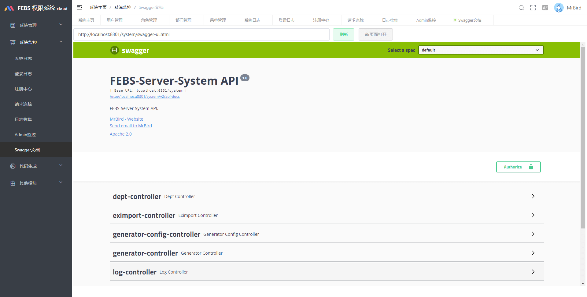
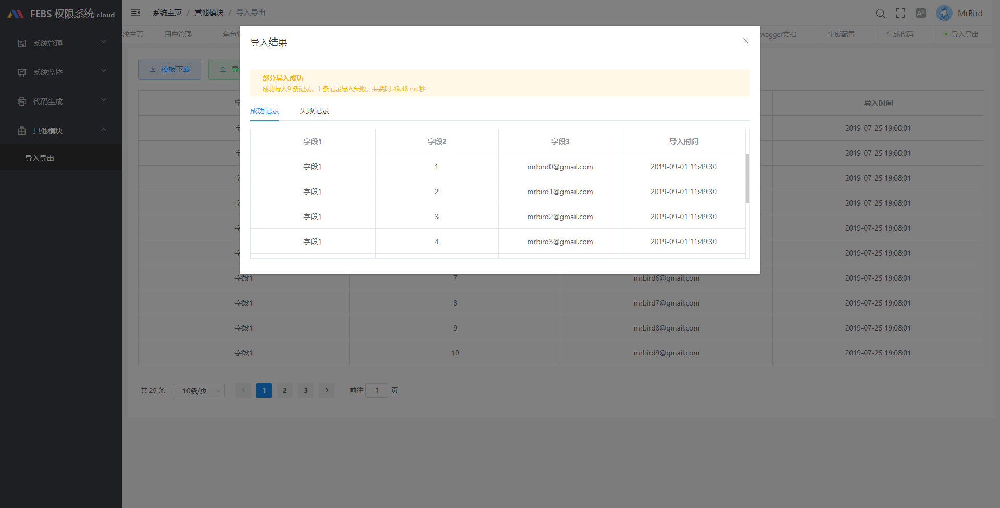
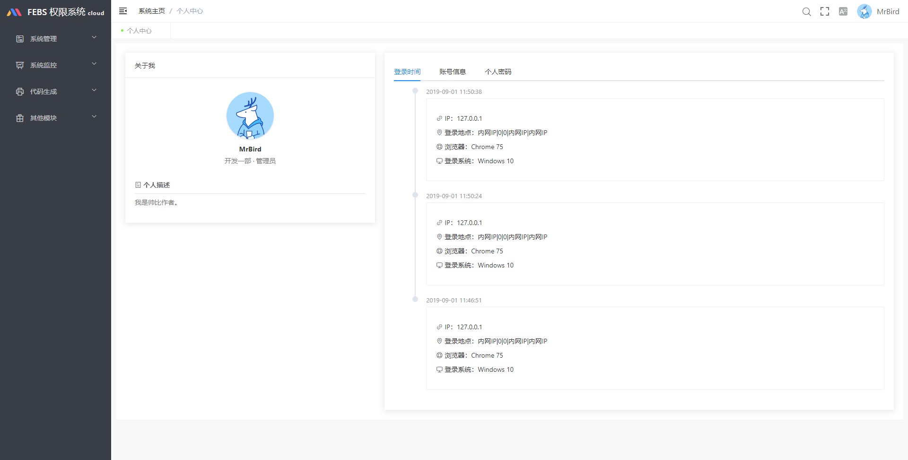
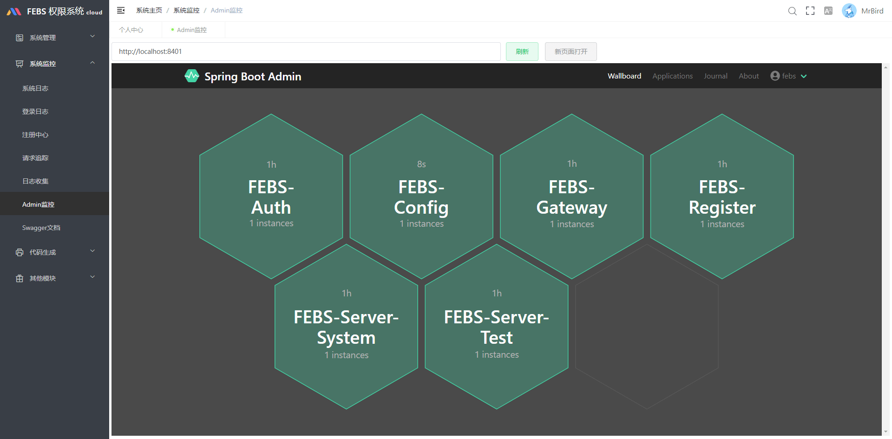

### FEBS Cloud Web

FEBS Cloud Web是[FEBS Cloud](https://github.com/wuyouzhuguli/FEBS-Cloud)微服务权限系统的前端项目，基于[vue element admin](https://panjiachen.github.io/vue-element-admin-site/zh/)构建。详细介绍参见：[https://www.kancloud.cn/mrbird/spring-cloud/1263679](https://www.kancloud.cn/mrbird/spring-cloud/1263679)

### 系统截图

